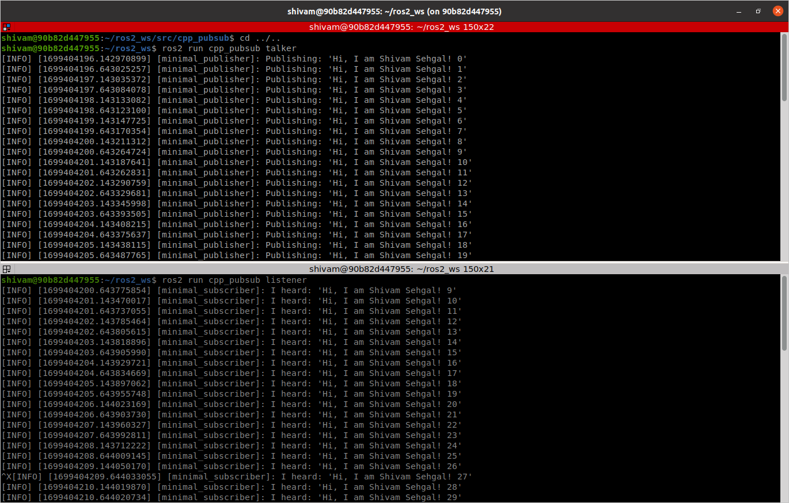

# Simple Publisher Subscriber for ROS2 Humble
- Tutorial to make simple pulisher subscriber in ROS2 humble using C++
- [Offical ROS2 Tutorial](http://docs.ros.org/en/humble/Tutorials/Beginner-Client-Libraries/Writing-A-Simple-Cpp-Publisher-And-Subscriber.html)

## Build Instructions
```bash
# Source to ROS2 HUMBLE
source /opt/ros/humble/setup.bash
# Make your ros2 workspace
mkdir ros2_ws
# Go to the source directory of your ros2 workspace
cd ~/ros2_ws
git clone git@github.com:shivamsehgal77/beginner_tutorials.git

# Install rosdep dependencies before building the package
rosdep install -i --from-path src --rosdistro humble -y
# Build the package using colcon build
colcon build --packages-select cpp_pubsub
# After successfull build source the package
. install/setup.bash
# Run the publisher in terminal#1
ros2 run beginner_tutorials talker
# Run the subscriber in terminal#2 (Split the terminal and source ROS2 and the workspace setup.bash)
ros2 run beginner_tutorials listener 
```

## Result

