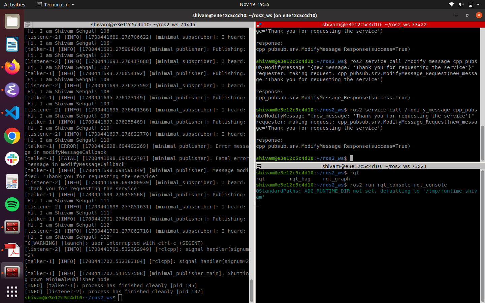
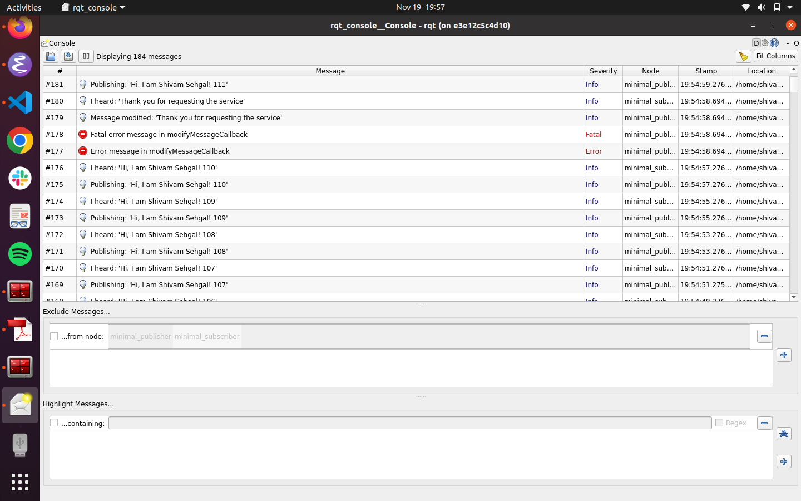

# Beginner Tutorial ROS2
- Part1_Release  simple publisher and subscriber program is created using ROS2 Humble and Object Oriented approach for C++.
- Part2_Release ros service caller
- Part3_Release ros bagging and testing

# Simple Publisher Subscriber for ROS2 Humble
- Tutorial to make simple pulisher subscriber in ROS2 humble using C++
- [Offical ROS2 Tutorial](http://docs.ros.org/en/humble/Tutorials/Beginner-Client-Libraries/Writing-A-Simple-Cpp-Publisher-And-Subscriber.html)


## Build Instructions
```bash
# Source to ROS2 HUMBLE
source /opt/ros/humble/setup.bash
# Make your ros2 workspace
mkdir ros2_ws
# Go to the source directory of your ros2 workspace
cd ~/ros2_ws
git clone git@github.com:shivamsehgal77/beginner_tutorials.git

# Install rosdep dependencies before building the package
rosdep install -i --from-path src --rosdistro humble -y
# Build the package using colcon build
colcon build --packages-select cpp_pubsub
# After successfull build source the package
. install/setup.bash 
```
## Run Publisher and Talker(Use the launch file instead)
```bash
# Run the publisher in terminal#1
ros2 run beginner_tutorials talker
# Run the subscriber in terminal#2 (Split the terminal and source ROS2 and the workspace setup.bash)
ros2 run beginner_tutorials listener 
```
## Launching Using Launch File and Calling serice from terminal
```bash
# Launch the subsrciber and publisher node using the launch file 
ros2 launch cpp_pubsub cpp_pubsub_launch.py pub_freq:=0.5 # accepts pub_freq as a parameter(#optional Default value 1 Hz)
# Open another terminal source the overlay 
source install/setup.bash
# Call the ROS service to modify mesaage
ros2 service call /modify_message cpp_pubsub/ModifyMessage "{new_message: 'Thank you for requesting the service'}"
```
## Bagging and Testing
```bash
# Run command for checking the tf Publishing topic
# Run the publisher in terminal#1
ros2 run cpp_pubsub talker
# Run the following command in terminal#2
ros2 run tf2_tools view_frames # Generates pdf of tf tree
ros2 run tf2_ros tf2_echo world talk # Pings the publisher to get tf frame messages
# For rosbagging kill the talker node in Terminal#1
ros2 launch cpp_pubsub rosbag_launch.py freq:=1.0 record_rosbag:=True #Note if record_rosbag is False then no rosbag will be recording
# Once done recording to view the bag info or play the rosbag
ros2 bag play outputs/rosbag2_2023_11_29-22_08_48_0.db3 #For playing the rosbag
ros2 bag info outputs/rosbag2_2023_11_29-22_08_48_0.db3 #For info of the bag file
# While playing the bag file in terminal#2 run the listener node
ros2 run cpp_pubsub listener
# For running the ros test
colcon build --packages-select cpp_pubsub # Build the package
source install/setup.bash # Source the package
colcon test --packages-select cpp_pubsub # Command to run the test
cat log/latest_test/cpp_pubsub/stdout_stderr.log # Command to view the test result
```

## Result
### Service Call Terminal Output 

### rqt console screenshots with logging level

